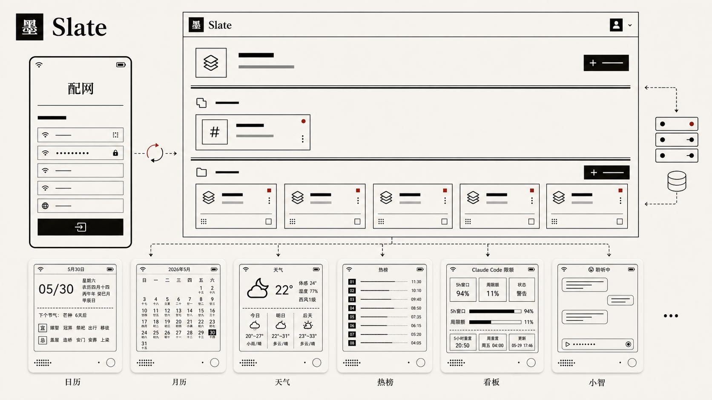

# Slate

Slate（墨笺）是一个面向 400 × 300 黑白墨水屏设备的开源相框 / 信息看板 / 语音玩具项目。把照片、实时资讯和自定义仪表板推送到一块墨水屏上，用按键翻页、用语音朗读。仓库涵盖设备固件、后端 API、Web 管理端和前后端共享 schema，可以完全自托管。



## 功能特性

### 内容类型

每块屏幕上的内容由「内容组」组织，组内可以混放两大类内容，设备按键翻页轮播：

- **静态图片**：浏览器内裁剪、缩放、抖动预览，后端用 sharp 渲染成 1bpp。支持 6 种抖动算法适配不同画面——
  `threshold`（纯黑白线稿）、`bayer4` / `bayer8`（粗 / 细网点）、`floyd`（照片推荐）、`atkinson`（高对比）、`sierra`（柔和）。
- **动态内容**：后端实时拉取数据并渲染成墨水屏帧，到点自动刷新。共 9 种，见下表。

### 动态内容一览

| 类型 | 说明 | 可配置项 |
| --- | --- | --- |
| 日历（日视图） | 当天农历 / 公历单日卡片 | — |
| 日历（月视图） | 整月日历网格 | — |
| 天气 | 实时天气与预报（和风天气 QWeather） | 城市搜索 |
| 历史上的今天 | 每日历史事件 | 数据源：Wikipedia / 百度百科 |
| 气象预警 | 按省份的官方气象预警 | 31 个省 / 自治区 / 直辖市，或全国 |
| 地震速报 | 全国最新地震信息 | 刷新间隔（自动拉取，无需配置） |
| 热榜 | 主流站点热门榜单 | **86 个榜单源**，覆盖综合 / 新闻 / 科技 / 社区 / 消费 5 类（知乎、微博、B站、GitHub、V2EX、HackerNews、少数派……） |
| 信息仪表板 | 自定义数据看板，外部 API 推送 | 2 个内置模板（AI 使用统计 / AI 限额监控）+ 完全自定义的区块布局 |
| 字体测试 | 点阵字体上屏预览 | **26 种**针对墨水屏优化的点阵 / 拉丁 / 图标字体，可反色 |

### 音频与语音

- **音频朗读**：日历、天气、历史上的今天、气象预警、地震速报等动态内容，以及静态图片，都可以挂一段音频，翻到该帧时由设备播放。
- **上传或 TTS 合成**：可上传音频文件（ffmpeg 转 16 kHz mono PCM），或填文案用 OpenAI 兼容 TTS 流式合。
- **语音玩具**：固件集成小智（xiaozhi）协议，支持语音对话交互。

### 信息仪表板（Dashboard）

仪表板是一种可编程的动态内容：用 JSON 描述区块布局（文本、指标、进度条、趋势线、矩形、直线等），再通过带能力 URL 的 `POST /api/v1/contents/:id/data` 把数据推上去，屏幕按间隔重渲染。适合把 CI 状态、家庭传感器、AI 用量等任意外部数据点亮到墙上的墨水屏。

### 设备与同步

- **零配置配对**：首次开机起 SoftAP + captive portal 填 Wi-Fi 与服务端地址，屏幕显示 6 位配对码，Web 端输入即绑定。
- **增量同步**：设备 poll 上报 telemetry，按 manifest / 内容 ETag 增量下载图片与音频，命中 304 不重复传，LittleFS 本地缓存。
- **低功耗刷新**：静态帧深睡按需唤醒，动态帧按 `next_wake_sec` 配 RTC 定时唤醒，局部刷新只更新变化区域。
- **Web 管理端**：React 管理后台，管理设备与内容组，提供图片裁剪 / 抖动预览、动态内容配置与实时预览、音频与 TTS 配置、拖拽排序。

## 技术栈

- `firmware/`：ESP-IDF 5.5.x 固件，目标板为 ZecTrix Note4 V1.0（ESP32-S3 + 4.2" EPD + ES8311 音频 + 按键 + 电池）。
- `backend/`：Bun + NestJS 11 + Fastify + Prisma 7 + MySQL 8，负责账号、设备、内容组、内容、动态帧渲染、音频转码和设备同步协议。
- `frontend/`：React 19 + Vite 8 + Tailwind v4 的 Web 管理端。
- `shared/`：前后端共享的 zod schema、动态内容配置、dither 和图像预处理纯函数。

## 仓库结构

```text
slate/
├── backend/        NestJS API、Prisma schema、动态帧/图片/音频渲染
├── frontend/       React Web 管理端
├── shared/         前后端共享 TypeScript 源码
├── firmware/       ESP-IDF 固件工程
├── compose.yml     单机自托管示例，内置 MySQL
├── Dockerfile      生产单镜像：backend + frontend dist
├── entrypoint.sh   容器入口：server 模式启动 backend，job 模式运行脚本
└── package.json    Bun workspace 根配置
```

详细文档：

| 模块 | 文档 |
| --- | --- |
| 后端 API、数据模型、环境变量、部署细节 | [backend/README.md](backend/README.md) |
| Web 管理端、路由、设计系统、数据流 | [frontend/README.md](frontend/README.md) |
| 共享 schema、动态配置、1bpp 图像管线 | [shared/README.md](shared/README.md) |
| 固件、硬件规格、GPIO/电源、同步协议、低功耗 | [firmware/README.md](firmware/README.md) |

## 端到端流程

```text
首次开机
  └─ NVS 没有 Wi-Fi/服务端凭据
     └─ 启动 SoftAP + captive portal（Slate-XXXX）
        └─ 用户填写 Wi-Fi 与 backend URL
           └─ 重启后连接 STA、SNTP 对时
              └─ POST /api/v1/devices 注册设备，拿 device_secret + pair_code

设备绑定
  └─ 固件屏幕显示 6 位 pair_code
  └─ Web 管理端输入 pair_code
     └─ 后端 claim 设备，绑定 owner_user_id，并轮换 pair_code

内容管理（内容类型详见上文「功能特性」）
  └─ Web 创建内容组和内容
     ├─ 图片内容：浏览器预览裁剪 + shared dither，后端 sharp 渲染 1bpp
     ├─ 音频：上传音频经 ffmpeg 转 16 kHz mono s16le PCM
     ├─ TTS：OpenAI-compatible TTS 流式返回 PCM，再重采样到设备格式
     └─ 动态内容：后端实时拉取数据渲染成帧，按调度自动刷新

设备同步
  └─ POST /api/v1/devices/current/poll 上报 telemetry
     └─ 收到 DeviceState（绑定状态、当前内容组、manifest etag、可选 current_content）
        └─ manifest 变化时 GET /groups/:gid/manifest
           └─ 增量 GET /contents/:id/image 与 /audio，ETag 命中返回 304
              └─ LittleFS 缓存后本地翻页、局刷 EPD、播放 PCM

低功耗刷新
  └─ 静态帧不定时唤醒
  └─ 动态帧按 next_wake_sec 配 RTC timer
     └─ timer wake 后只刷新当前帧；manifest 变化时回退完整同步
```

HTTP API 统一挂在 `/api/v1` 下，`/healthz` 是唯一不带前缀的健康检查端点。设备鉴权使用 `Authorization: Bearer <device_secret>`，Web 管理使用 JWT。完整端点和鉴权矩阵见 [backend/README.md](backend/README.md)。

## 本地开发

依赖：

- Bun 1.x
- MySQL 8
- ffmpeg（后端处理音频需要；Docker 镜像内已安装）
- ESP-IDF v5.5.x（仅构建固件需要）

启动 MySQL：

```bash
docker run -d --name slate-mysql -p 3306:3306 \
  -e MYSQL_ROOT_PASSWORD=root \
  -e MYSQL_DATABASE=slate \
  -e MYSQL_USER=slate \
  -e MYSQL_PASSWORD=slate \
  mysql:8
```

安装依赖并初始化数据库：

```bash
bun install
cp backend/.env.example backend/.env
bun run --cwd backend prisma:generate
bun run --cwd backend prisma:migrate
```

运行开发服务：

```bash
bun run dev:backend     # http://localhost:3001
bun run dev:frontend    # http://localhost:5173，Vite proxy /api 与 /healthz 到 :3001
```

首次访问 `http://localhost:5173/register` 注册账号。

本地后端读取 `backend/.env`。根目录 `.env` 只给 Docker Compose 变量替换使用，不会被开发模式的 Nest 后端读取。

## 固件构建

```bash
source $IDF_PATH/export.sh
idf.py -C firmware build
idf.py -C firmware -p <serial> flash monitor
```

target、分区表、Flash/PSRAM 配置已经固化在 `firmware/sdkconfig.defaults`，无需手动 `idf.py set-target`。

## 常用校验

```bash
bun run format:check
bun run lint
bun run typecheck
bun run --cwd backend test
bun run --cwd frontend build
```

说明：

- `format:check` 只覆盖 `ts` / `tsx` / 普通 `json`，不格式化固件 C/C++。
- 后端 typecheck/test 前需要 `prisma generate`，CI 会自动执行。
- 后端测试使用 Bun test；不需要连接真实 MySQL 的测试会使用 dummy `DATABASE_URL`。

## Docker 部署

生产镜像是单镜像：backend 直接运行 TypeScript，frontend 的 `dist/` 由 backend 同域静态托管，API 和 Web 共用一个端口。

稳定版部署文件随 GitHub Release 上传；以下命令在首个正式 release 发布后可用。

```bash
curl -fLO https://github.com/qiujun8023/slate/releases/latest/download/compose.yml
curl -fLo .env.example https://github.com/qiujun8023/slate/releases/latest/download/slate.env.example
cp .env.example .env
```

编辑 `.env`：

```bash
openssl rand -hex 32   # 填 MYSQL_PASSWORD
openssl rand -hex 64   # 填 JWT_SECRET
```

启动：

```bash
mkdir -p slate/blobs mysql
sudo chown -R 1000:1000 slate
docker compose up -d
curl -fsS http://localhost:3001/healthz
```

健康后访问 `http://<host>:3001/register` 注册第一个账号。

持久化目录：

| 主机路径 | 容器路径 | 内容 |
| --- | --- | --- |
| `./slate/` | `/data/` | blob 根目录，主要是 `/data/blobs` |
| `./mysql/` | `/var/lib/mysql/` | MySQL datadir |

升级：

```bash
docker compose pull
docker compose up -d
```

镜像 tag：

- `latest`：最新稳定发布版本
- `vX.Y.Z` / `X.Y`：指定稳定发布版本
- `master`：master 最新构建
- `sha-<short>`：按 commit 固定版本

## 版本与发布

稳定版本见 GitHub Releases。Slate 使用单一产品版本号：一个 `vX.Y.Z` tag 同时发布生产 Docker 镜像和固件产物。

正式发布由 annotated tag 触发：

```bash
git tag -a v0.2.0
git push origin v0.2.0
```

tag body 会作为 GitHub Release notes。详细流程见 [CONTRIBUTING.md](CONTRIBUTING.md#发布版本)，本地 AI 代理执行发版时还应遵守 [AGENTS.md](AGENTS.md)。

## CI

`.github/workflows/` 当前包含：

| 工作流 | 触发 | 内容 |
| --- | --- | --- |
| `ci.yml` | PR、push 到 `master`、手动触发 | format + lint、typecheck、backend test、frontend build |
| `docker.yml` | push 到 `master`、手动触发 | buildx 构建 linux/amd64 + linux/arm64 并推送 GHCR |
| `firmware.yml` | `firmware/**` 变化、手动触发 | ESP-IDF v5.5.2 构建并上传 `slate-full.bin` / `slate-ota.bin` |
| `release.yml` | push `vX.Y.Z` tag | 校验版本，推送 release Docker tag，构建固件并创建 GitHub Release |

## 贡献

欢迎 issue 和 PR。开发约定见 [CONTRIBUTING.md](CONTRIBUTING.md)。
